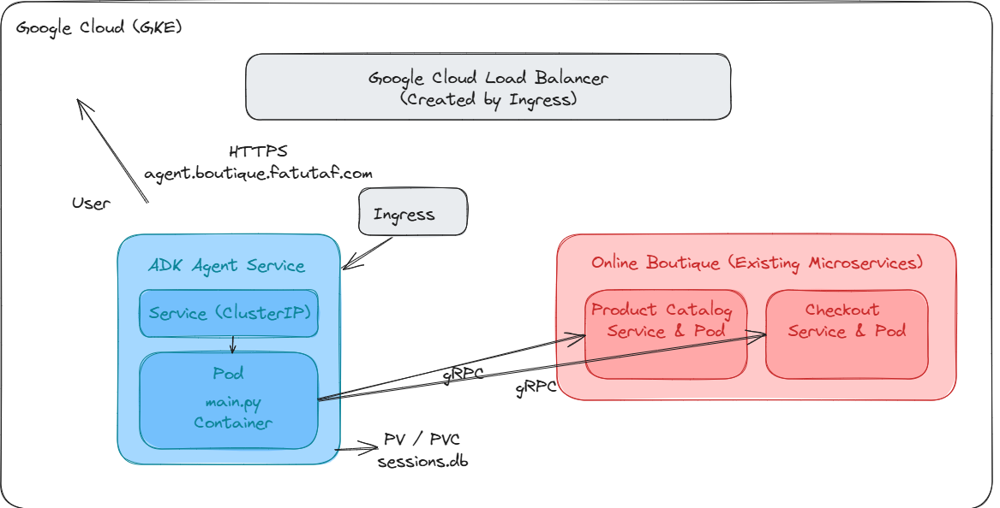

# Multi-Tool Agent

A Google Agent Development Kit (ADK) application that provides intelligent shopping assistance for the Online Boutique microservices demo.

## What it does

This agent connects to the microservices backend and provides:
- Product catalog browsing
- Shopping cart management 
- Checkout assistance
- Natural language interaction with the e-commerce platform

## GKE Deployment

The agent is containerized and deployed to Google Kubernetes Engine (GKE) as part of the microservices architecture:

- **Container**: Python 3.13 slim with ADK dependencies
- **Integration**: Connects to ProductCatalogService and CheckoutService via gRPC
- **Environment**: Configured for GKE service discovery and networking
- **Security**: Runs as non-root user with minimal permissions

## Quick Start

1. Build and deploy to GKE:
```bash
kubectl apply -f ../all-in-one.yaml
```

2. The agent automatically discovers and connects to other microservices in the cluster.

3. Access through the configured service endpoint for natural language shopping assistance.

## Architecture



- Uses Google ADK for AI-powered conversations
- gRPC communication with backend services
- Environment-based service discovery for GKE deployment
- Stateless design for horizontal scaling